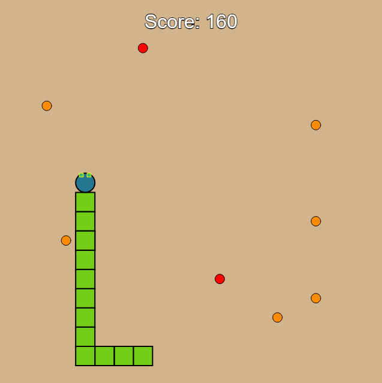
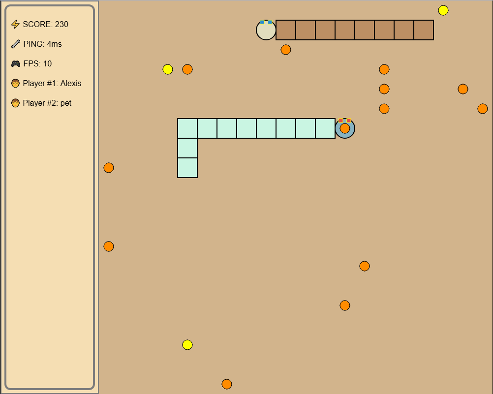

# Multiplayer Snake Game

## Overview
This is a multiplayer Snake game that connects players through a WebSocket server (https://github.com/alexisNorthcoders/go-ws). Players control their own snakes, collect food, and compete for the highest score. The game features walls, adjustable framerate, and different food types that affect scoring.

First version - single player


Multiplayer


## Features
- Multiplayer support via WebSockets
- Dynamic grid-based gameplay
- Customizable game settings (walls, grid, framerate)
- Score tracking
- Responsive design for different screen sizes
- Sound effects for eating food

## Technologies Used
- JavaScript (ES6)
- HTML5 Canvas
- WebSockets (ws://raspberrypi.local:4001/ws)

## Installation
1. Ensure you have a WebSocket server running at `ws://raspberrypi.local:4001/ws`.
2. Clone this repository:
   ```sh
   git clone https://github.com/yourusername/multiplayer-snake.git
   ```
3. Navigate to the project folder:
   ```sh
   cd multiplayer-snake
   ```
4. Open `index.html` in a browser.

## How to Play
- Use **Arrow keys** or **WASD** to move your snake.
- Eat food to increase your score.
- Avoid collisions with walls (if enabled) and other players.
- The game starts automatically when you press any movement key or click the screen.

### Controls
| Key | Action |
|-----|--------|
| 1 | Toggle walls |
| 2 | Toggle grid |
| + | Increase framerate |
| - | Decrease framerate |
| R | Restart game |
| ENTER | Pause/resume game |

## Game Mechanics
- **Food Types:** Normal and Super food types appear randomly on the grid.
- **Scoring System:** Eating the same food type consecutively gives bonus points.
- **Collision Handling:** Players can enable or disable wall collisions.

## WebSocket Events
- **newPlayer**: Registers a new player.
- **playerMovement**: Sends movement data for each player.
- **playerDisconnected**: Removes a player when they disconnect.

## API Endpoints
- `GET /snake/score/{userId}` - Retrieve the player's score.
- `POST /snake/score/{userId}` - Submit a new score.

## TODO
- ✅ Move start game logic to server  
- ✅ Move food spawn logic to server
- ✅ Add waiting room for players
- ✅ Add ping counter
- ✅ Set color in waiting room screen
   - ✅ Server - server broadcasts the color
   - ✅ Client - color is chosen and sent to the server to be broadcast
- ✅ Add tail size in server
- ✅ Send game config when game starts 
   - ✅ food position
   - ✅ players starting position
   - ✅ Configs being fetched from Contentful CMS
- ✅ Move player position logic to the server
   - ✅ Server snake is rendered with server sent positions and not using client logic  
   - ✅ Player snake is rendered with server sent positions and not using client logic
- Add respawn food logic after snake eats food
- Add snake collision to its own body
- Move pause game logic to server
- Add score logic to the server
- Add dead status
- Allow multiple rooms
- Allow for single game mode / local multiplayer only
- Single game mode features only ( framerate, canvas resize, etc)
- Optimize websockets message to reduce size and increase performance

## Bugs
- ✅ Food being spawned many times or in not in the same place for all clients 
   - server now updates the position of the food eaten without creating a new food
- ✅ Initial load of the page often times won't connect to the ws and requires refreshing the page ( client or server problem?)
   - Fixed by moving socket logic outside of setup() 
- 🚨 Fix colors not being set on waiting room and breaking the game 
- Debug drawing grids
- Fix scale factor UI (text too big, or too small)